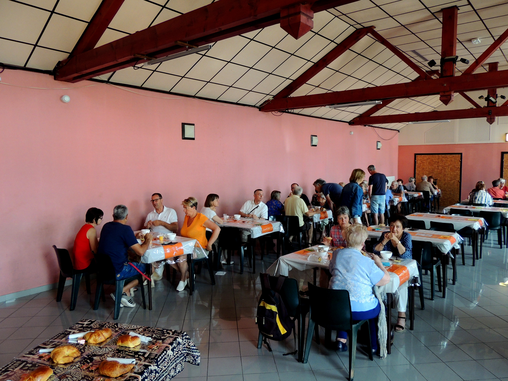
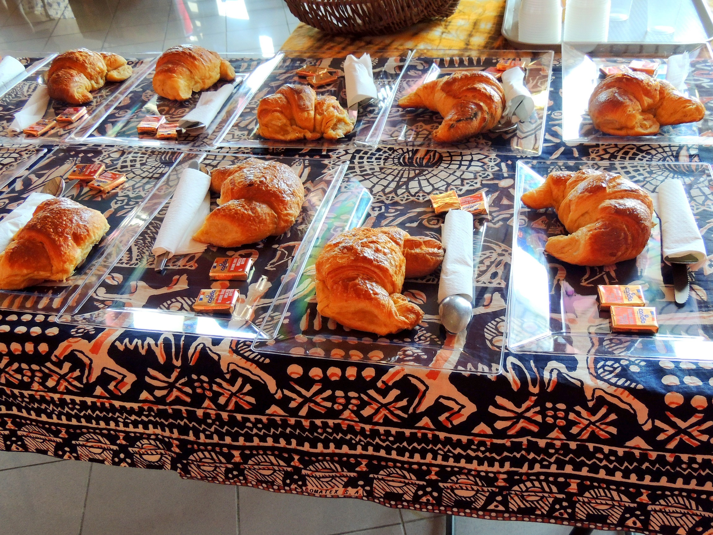

Un grand merci aux amis venus déguster le P'tit Dèj de Koulenga de même qu'aux artistes et bricoleurs qui ont donné une de leur réalisation. Tous participent au soutien des écoliers de Goudrin.
Vous trouverez "LE JOURNAL DE GOUDRIN" N°10 en cliquant sur l'onglet correspondant. On ne peut qu'admirer le volonté des jeunes écoliers et de l'ensemble des Burkinabé!
Bonnes vacances à tous!