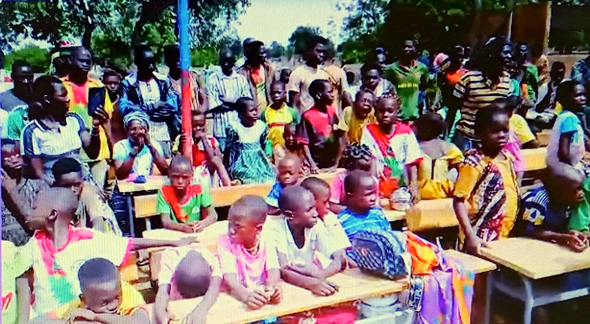

Message de Saabane (notre correspondant au Burkina):
**"****Le taux de succès au Certificat d'études Primaires session 2026 est de 100% à Goudrin.**** Une première dans l'histoire de l'école de Goudrin. 
Avec une équipe enseignante très dynamique et un soutien indéfectible de l'association Koulenga France, on ne peut  rêver mieux. Félicitations à tous et merci beaucoup.
28 élèves étaient présentés : 16 filles, 12 garçons"**
Un grand bravo à eux et à l'équipe pédagogique !

