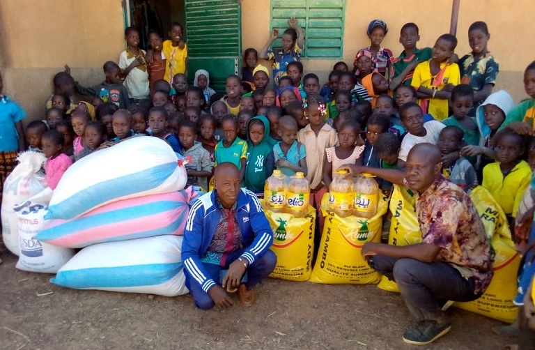

Au Burkina Faso Comme en France, la rentrée scolaire a eu lieu. Les élèves de Goudrin comptent toujours sur notre aide pour la cantine.
Comme chaque année, les élèves de CM2 - 6ème et 5ème du groupe scolaire Saint Joseph vont participer en courant pour Koulenga.
Vous pouvez les soutenir le mardi 17 octobre à partir de 8h30 au stade de Marchon.