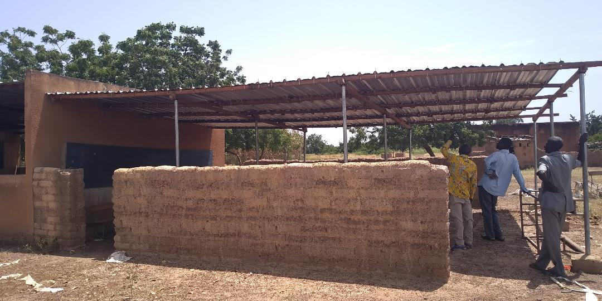
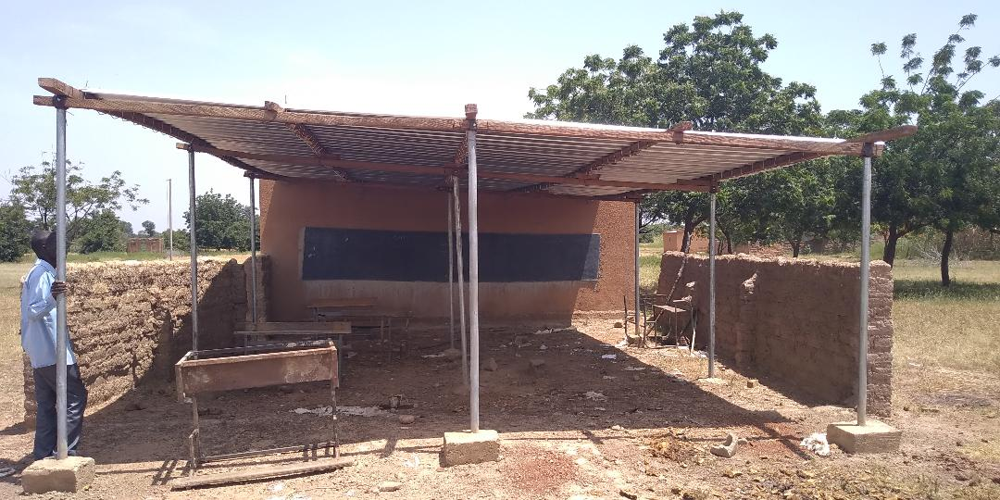

Koulenga - _Ouverture_  en moré  - est une association loi 1901, née en 2005 par la volonté de quelques personnes qui, suite à un voyage au [Burkina Faso](https://fr.wikipedia.org/wiki/Burkina_Faso), ont voulu participer à la scolarisation des jeunes burkinabé à l'école de Goudrin.
L'association se veut au plus près des besoins de l'école elle a donc évolué régulièrement en 13 ans d'existence et continue à le faire.
Koulenga peut maintenant s'appuyer sur Teeli Yan - _Soutenir_ en moré - association qui en lien avec les parents d'élèves fait remonter les besoins et en suit la réalisation sur place.
Ce nouveau site va vous permettre d'être au courant des activités en France et au Burkina !

# Actualités

Des jeunes ressortissants du village, à Ouagadougou pour leurs études ou leur travail, ont voulu apporter leur pierre à l'édifice de l'école. Ils ont érigé un hangar qui servira de classe. 

