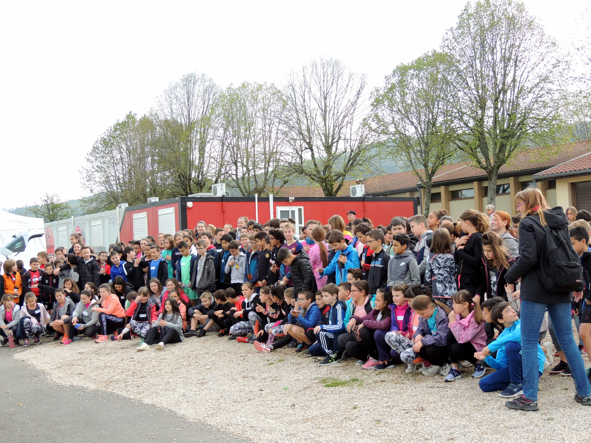

Koulenga - _Ouverture_  en moré  - est une association loi 1901, née en 2005 par la volonté de quelques personnes qui, suite à un voyage au [Burkina Faso](https://fr.wikipedia.org/wiki/Burkina_Faso), ont voulu participer à la scolarisation des jeunes burkinabé à l'école de Goudrin.
L'association se veut au plus près des besoins de l'école elle a donc évolué régulièrement en 13 ans d'existence et continue à le faire.
Koulenga peut maintenant s'appuyer sur Teeli Yan - _Soutenir_ en moré - association qui en lien avec les parents d'élèves fait remonter les besoins et en suit la réalisation sur place.
Ce nouveau site va vous permettre d'être au courant des activités en France et au Burkina.

# Actualités
**Novembre 2024**
Installation de l'éclairage dans la cour de l'école de Goudrin et permet aux enfants de travailler aux devoirs le soir.

**Avril 2024**
Le P'tit Dèj a réuni des adhérents et des amis qui ont aussi pu profiter du stand "Articles d'ici et d'ailleurs". Rappelons que le bénéfice de la journée participe à la somme destinée en partie à la cantine de Goudrin.

**Décembre 2022** Ce jeudi 15 décembre nous étions nombreux pour accompagner Colette. Trésorière active de Koulenga depuis la création de l’association, elle restera présente dans toutes les actions que nous continuerons pour l’école de Goudrin.
Saabane Ouédraogo (notre référent au Burkina) nous a communiqué un message dont voici un extrait.
« Tu as été et tu seras vivante dans nos pensées. 
Ton combat et tes actions à travers l'association Koulenga en faveur du village de Goudrin et son école 
ont porté des fruits. 
Tu peux t’estimer heureuse d'avoir été utile sur terre pour ta famille et pour des gens à des milliers de kilomètres de chez toi…
Colette nous ne t'oublierons jamais. 
Que la terre te soit légère. »

**Avril 2022** Assemblée Générale pour l'année 2021 (Compte-rendu à l'onglet "l'association").
**Mars 2021**. Participation de l'association au financement de l'installation de l'électricité au Centre sanitaire de Goudrin - cette installation va permettre à l'infirmier de travailler dans de bonnes conditions et en toute sécurité.
**Février 2021**: L'assemblée générale ne pouvant se tenir en raison des normes sanitaires, un bilan (rapports moral et financier) a été communiqué aux adhérents et donateurs - Vous pouvez le trouver à l'onglet "association" de ce site.
**Janvier 2021 **.  Nous avons reçu confirmation de l'arrivée du matériel scolaire: dictionnaires, règles, équerres, globes terrestres...
**Le jeudi 7 novembre** dans le cadre de leur thème de travail " action humanitaire"des élèves de seconde du lycée Painlevé ont couru pour notre association. 
Merci eux et aux professeurs qui les ont accompagnés pour cette manifestation

* Début octobre: cross "courir et sourire pour Koulenga" avec les 6ème et CM2 du Collège St Joseph
* KOULENGA dans les écoles:!! 
* Janvier 2019 : [Le compte rendu de l'assemblée générale est disponible](COMPTE%20RENDU%20AG%202018.pdf)
* Février 2019: l'Etat Burkinabé a construit un nouveau batiment école de 3 classes. 
* Septembre 2018 : Des jeunes ressortissants du village, à Ouagadougou pour leurs études ou leur travail, ont voulu apporter leur pierre à l'édifice de l'école. Ils ont érigé un hangar qui servira de classe.
