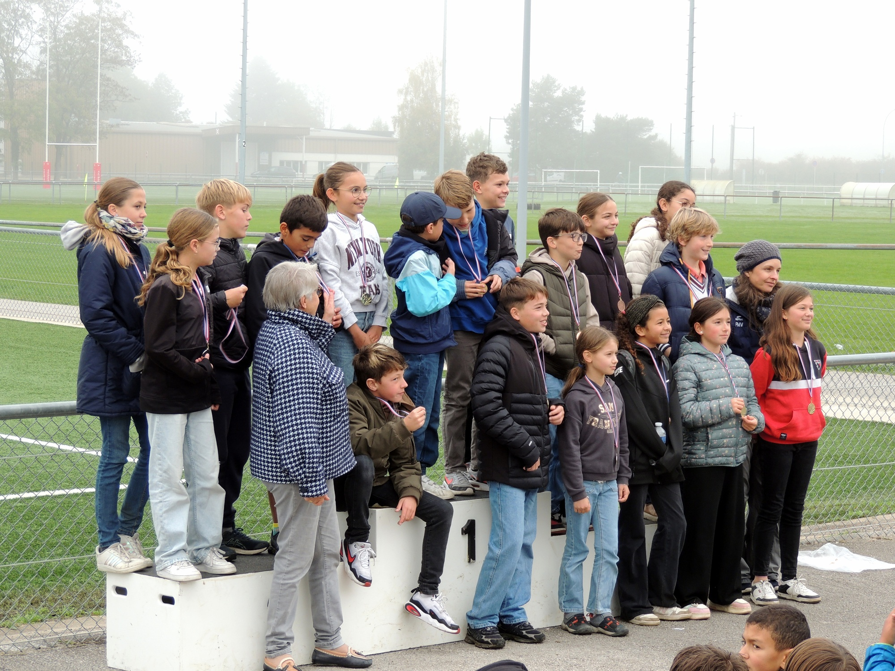
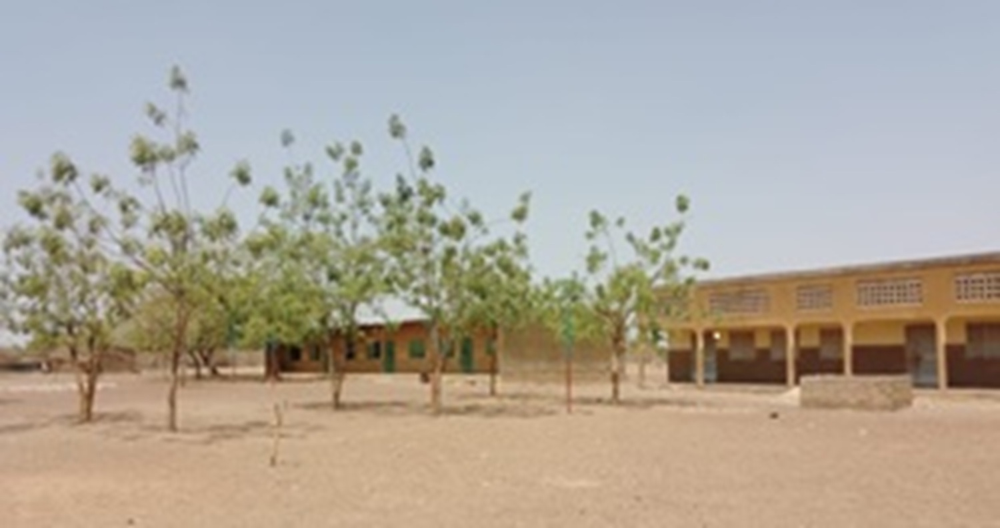
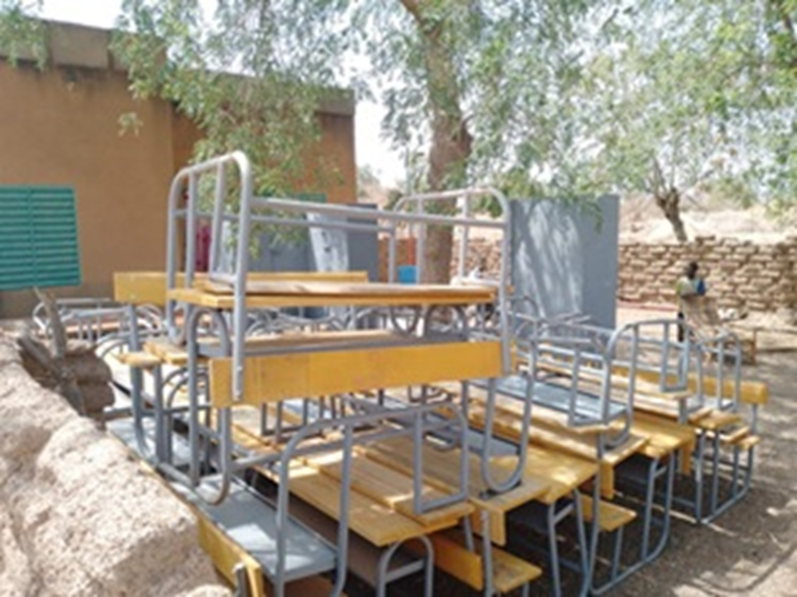

Koulenga - _Ouverture_  en moré  - est une association loi 1901, née en 2005 par la volonté de quelques personnes qui, suite à un voyage au [Burkina Faso](https://fr.wikipedia.org/wiki/Burkina_Faso), ont voulu participer à la scolarisation des jeunes burkinabé à l'école de Goudrin.
L'association se veut au plus près des besoins de l'école elle a donc évolué régulièrement en 13 ans d'existence et continue à le faire.
Koulenga peut maintenant s'appuyer sur Teeli Yan - _Soutenir_ en moré - association qui en lien avec les parents d'élèves fait remonter les besoins et en suit la réalisation sur place.
Ce nouveau site va vous permettre d'être au courant des activités en France et au Burkina.

# Actualités

Podium final avec tous les médaillés 2025

Fraîcheur et brouillard pour la matinée **"CROSS 2025"** des élèves de  Saint Joseph mais beaucoup d'ardeur pour les coureurs et leurs fans.                                                  
Un grand merci à eux !
Merci aussi aux profs d'E.P.S qui ont organisé et encadré, aux enseignants et parents de l'A.P.E.L qui ont apporté leur soutien.
La somme collectée à l'occasion du cross permet chaque année de soutenir les écoliers de Goudrin en participant aux frais de cantine ou d'équipement des classes.

**Juillet 2025**
Les tables bancs sont arrivées à Goudrin et attendent l’installation dans les salles de classes.
 

**Novembre 2024****
Installation de l'éclairage dans la cour de l'école de Goudrin et permet aux enfants de travailler aux devoirs le soir.
 
**Décembre 2022** Ce jeudi 15 décembre nous étions nombreux pour accompagner Colette. Trésorière active de Koulenga depuis la création de l’association, elle restera présente dans toutes les actions que nous continuerons pour l’école de Goudrin.
Saabane Ouédraogo (notre référent au Burkina) nous a communiqué un message dont voici un extrait.
« Tu as été et tu seras vivante dans nos pensées. 
Ton combat et tes actions à travers l'association Koulenga en faveur du village de Goudrin et son école 
ont porté des fruits. 
Tu peux t’estimer heureuse d'avoir été utile sur terre pour ta famille et pour des gens à des milliers de kilomètres de chez toi…
Colette nous ne t'oublierons jamais. 
Que la terre te soit légère. »

