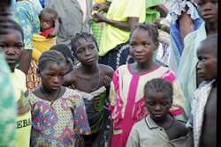

# Les actions de Koulenga en France :

Les objectifs sont de trouver des parrains, des fonds mais aussi de faire connaître le Burkina, ses habitants, le village de Goudrin. Pour cela, nous rencontrons les medias (presse écrite ou radio), nous présentons un diaporama dans les établissements scolaires publics ou privés :

En 2010 / 2011 nous avons rencontré :
- les classes de les écoles maternelles de Dortan.
- la classe de 2nde SMS du lycée Paul Painlevé.
- deux classes de 5è du collège Saint Joseph.

Les élèves de 6e et de 5e du collège Saint Joseph ont participé au cross *Courir pour Koulenga*.

En ville nous avons participé :
- à la fête du prinptemps le 26 avril en collaboration avec trois autres associations intervenant en Afrique (stand à la Grenette).
- à une action menée par le centre social Ouest , en novembre, dans le cadre de la S.S.I.
- à la manifestation : *Association en fête* le 10 septembre à Valexpo.

Nous sommes toujours prêts à répondre positivement aux invitations des écoles, des associations, des groupes qui veulent connaître Koulenga, connaître le Burkina.

# Les parrains :

En mars 2008, il y avait 99 parrains qui se sont engagés pour soutenir un écolier pendant 6 ans.
A la rentrée 2010 nous sommes 130.
L'argent du parrainage est mutualisé, et sert donc à tous les élèves et à toute l'école. Chacun peut écrire à son filleul comme il le souhaite. On peut aussi envoyer un colis. Pour des raisons diverses, le colis doit être petit et un seul colis par an semble suffisant.

# Le conseil d'administration

Il est composé de 9 membres : 3 pour le bureau et 5 administrateurs .

- La présidente : Marie-Hélène Sibois
- La trésorière : Colette Ferrandon
- La secrétaire : Geneviève Balland

Administrateurs : Bintou-Corinne Nacoulma, Brigitte Duraffourg, Marie Odile Pernod, Christian Aymoz, Jean-Yves Boitet, Gérard Sibois.

----

