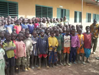
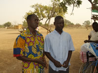
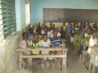

---
L'école est située à Goudrin et accueille les enfants des cinq villages.

A la rentrée 2011, 205 élèves ont été répartis sur les 3 niveaux : 

* CP1 et CP2
* CE1 et CE2
* CM1 et CM2

17 élèves de Goudrin sont partis au collège.

Trois instituteurs se partagent ce groupe :
* Fati Soré : CP1 / CP2
* Germaine Zouggmoré : CE1 /CE2
* Olivier Sawadogo : CM1 / CM2

Les problèmes majeurs de l'école sont le faible taux de scolarisation, l'insuffisance du matériel pédagogique et le manque de fournitures scolaires.

Enseignants et parents de Goudrin ont réalisé en novembre 2004 un projet de parrainage, initiative qui permettra au plus grand nombre d'enfants d'accéder à l'éducation.

Quand ils arrivent à l'école, ils ne parlent pas du tout le français dont ils vont commencer l'apprentissage au C. P. Cet apprentissage se fait surtout à l'oral. Chez eux leurs parents parlent soit le moré soit le fulfuldé.