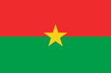

Habitants : les Burkinabé  (mot invariable)
Densité : 45 h/km2
Taux de natalité : 47 %
Taux de mortalité : 17 %
Espérance de vie :  52 ans
70 % de la population a moins de 20 ans

Taux de scolarisation : 39 % sur l'ensemble du pays
à Goudrin   : 19 %

Capitale : Ouagadougou
Langue officielle : le français
Densité : 45 h/km2

Langues parlées : 

* Moré (langue des Mossi de Goudrin)
* Fulfuldé (langue des Peuls de Goudrin)
* Dioula, Dagara, Gourmantché etc…

Monnaie :  franc CFA (1000 cfa = 10 francs  = 1,5 € ).
Régime politique : république parlementaire à suffrage universel.
devise : "Unité – Progrès –Justice".

Climat à Goudrin :
* une saison sèche d'octobre à mai
* une saison humide de juin à septembre .