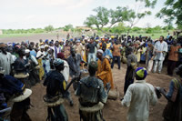

---
# Présentation du village :

Goudrin est un village d'environ 1300 habitants, entouré par quatre autres villages, à environ 70 km de OUAGADOUGOU, la capitale du Burkina Faso.

Deux ethnies vivent sur ce territoire :
- les Mossis qui sont des cultivateurs (mil).
- les Peuls qui sont des éleveurs (vaches et moutons).

Une monarchie traditionnelle dirige le village, avec à sa tête un chef coutumier assisté par les sages du village.

La population y est jeune car les familles polygames ont de nombreux enfants.

---

