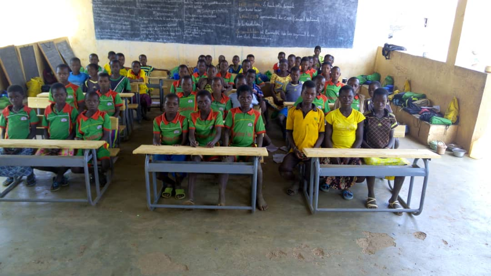

---
# Goudrin

Goudrin est un village d'environ 1300 habitants, entouré par quatre autres villages, à environ 70 km de [Ouagadougou](https://fr.wikipedia.org/wiki/Ouagadougou) la capitale du Burkina Faso.

Deux ethnies vivent sur ce territoire :
- les [Mossis](https://fr.wikipedia.org/wiki/Mossi_(peuple)), qui sont des cultivateurs (mil) et parlent le [Moré](https://fr.wikipedia.org/wiki/Mor%C3%A9) (langue nationale).
- les [Peuls](https://fr.wikipedia.org/wiki/Peuls) qui sont des éleveurs (vaches et moutons) et parlent le [fulfuldé](https://fr.wikipedia.org/wiki/Peul).
 
Une monarchie traditionnelle dirige le village, avec à sa tête un chef coutumier assisté par les sages du village. La population y est jeune, car les familles polygames ont de nombreux enfants.

# L'école

Située à Goudrin, elle accueille aussi les enfants de quatre villages voisins.
À la rentrée 2017, 263 élèves ont été répartis sur les 3 niveaux :
- CP1 et CP2 : 40 et 50
- CE1 et CE2 : 38 et 44
- CM1 et CM2 : 55 et 36

L'équipe enseignante pour les 263 élèves se compose de :
- 3 instituteurs
- 3 institutrices
- 1 directeur

Quand ils arrivent à l'école, les enfants ne parlent pas du tout le français car chez eux leurs parents parlent soit le moré (la langue nationale du Burkina) soit le fulfuldé.  

Ils commencent l'apprentissage de la langue française essentiellement de manière orale au CP.

Les problèmes majeurs rencontrés par l'école sont l'insuffisance du matériel pédagogique (salle de classe, bancs, chaises...)  et le manque de fournitures scolaires, les manuels étant fournis par le ministère de l'éducation de base et de l'alphabétisation.

**L'action de Koulenga, démarré en 2006,  a eu un impact certain sur l’accès à l'école, en particulier pour les filles.**

**Chaque année une quinzaine d'élèves de Goudrin partent au collège.**

---
 
 
