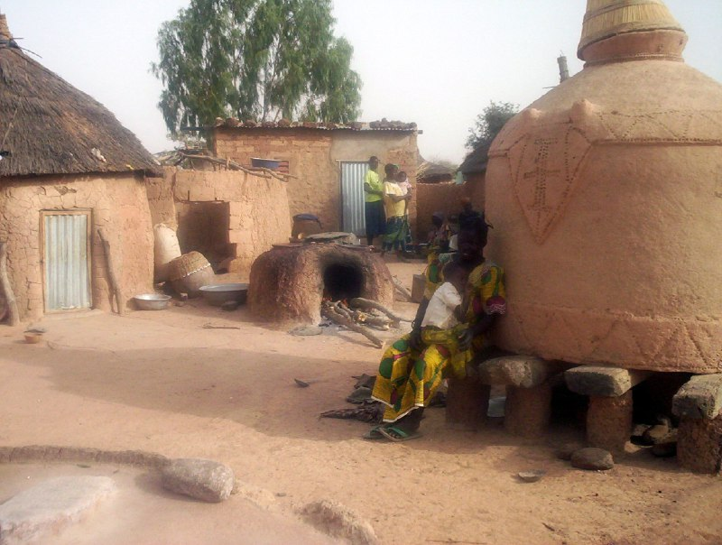

_« La priorité des priorités, c’est l’école »_
Sœur Emmanuelle

---
# Goudrin

Goudrin est un village d'environ 1300 habitants, entouré par quatre autres villages, à environ 70 km de [Ouagadougou](https://fr.wikipedia.org/wiki/Ouagadougou) la capitale du Burkina Faso.

Deux ethnies vivent sur ce territoire :
- les [Mossis](https://fr.wikipedia.org/wiki/Mossi_(peuple)), qui sont des cultivateurs (mil) et parlent le [Moré](https://fr.wikipedia.org/wiki/Mor%C3%A9) (langue nationale).
- les [Peuls](https://fr.wikipedia.org/wiki/Peuls) qui sont des éleveurs (vaches et moutons) et parlent le [fulfuldé](https://fr.wikipedia.org/wiki/Peul).
 
Une monarchie traditionnelle dirige le village, avec à sa tête un chef coutumier assisté par les sages du village. La population y est jeune, car les familles polygames ont de nombreux enfants.

# L'école

Située à Goudrin, elle accueille aussi les enfants de quatre villages voisins. Depuis 2 ans environ s'ajoutent les E.D.I (élèves déplacés internes) qui posent problèmes car ils demandent un accompagnement plus lourd. La qualité de la formation et les conditions de travail sont affectées.
La rentrée 2025 c'est bien passée avec une augmentation du nombre de filles, mais aussi pour les entrées en CP1 où il a fallu refuser du monde.

À la rentrée 2025/2026, 322 élèves ont intégrés l'école.
- CP1 : 76 élèves : 41 filles et 35 garçons dont 26 E.D.I
- CP2 : 53 élèves : 28 filles et 25 garçons dont 21 E.D.I
- CE1 : 47 élèves : 25 filles et 22 garçons dont 19 E.D.I
- CE2 : 55 élèves : 27 filles et 28 garçons dont 14 E.D.I
- CM1 :50 élèves:  21 filles et 29 garçons dont 12 E.D.I
- CM2 : 41 élèves: 23 filles et 18 garçons dont 10 E.D.I

**Résultats au CEP de 2025**:
- 24 élèves admis sur 26 présentés, soit **92,30% de réussite.**

L'équipe enseignante pour l'ensemble élèves se compose de :
- 8 enseignants dont un directeur.

Quand ils arrivent à l'école, les enfants ne parlent pas du tout le français car chez eux leurs parents parlent soit le moré (la langue nationale du Burkina) soit le fulfuldé.  

Ils commencent l'apprentissage de la langue française essentiellement de manière orale au CP.

Les problèmes majeurs rencontrés par l'école sont l'insuffisance du matériel pédagogique (salle de classe, bancs, chaises...)  et le manque de fournitures scolaires, les manuels étant fournis par le ministère de l'éducation de base et de l'alphabétisation.

**L'action de Koulenga, démarré en 2006**,  a eu un impact certain sur l’accès à l'école, en particulier pour les filles. Depuis quelques années elles sont souvent en nombre supérieur aux garçons.
La répartition filles/garçons reste sensiblement égale au fil des années.

**Chaque année des élèves de Goudrin partent au collège.** pris en charge par l'état ou par les parents...ou redoublent pour se représenter l'année suivante.

 
 

**Le jardin de l'école**
Pour diversifier et améliorer les repas de la cantine (essentiellement du riz et des haricots) le directeur et l'équipe enseignante ont mis en place un jardin dont les élèves s'occupent.

 

