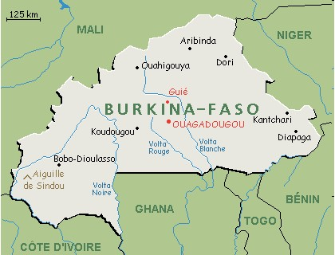

- Habitants : les Burkinabé (mot invariable)
- Capitale : Ouagadougou
- Population : 20 millions 
- Densité : 65 habitants / km2
- Taux de natalité : 46%     
- Taux de mortalité : 12%  
- Espérance de vie : 60 ans 

50% de la population a moins de 17 ans
Taux de scolarisation : 71% sur l'ensemble du pays en 2017

La population burkinabè est majoritairement rurale. Le taux d’urbanisation est de 27,5% contre 72,5% d’habitants vivant en milieu rural. Mais c’est un pays en forte croissance urbaine du fait de l’exode rural et de l’expansion urbaine qui englobe chaque année les villages environnants.

- Langue officielle : le Français
- Langues parlées :

    - Moré (langue des Mossi de Goudrin)
    - Fulfuldé (langue des Peuls de Goudrin)
    - Dioula, Dagara, Gourmantché, etc ...

- Régime politique : république parlementaire à suffrage universel.
- Devise : _"Unité - Progrès - Justice"_

---

**LE BURKINA FASO**
**LE PAYS DES HOMMES INTEGRES**

