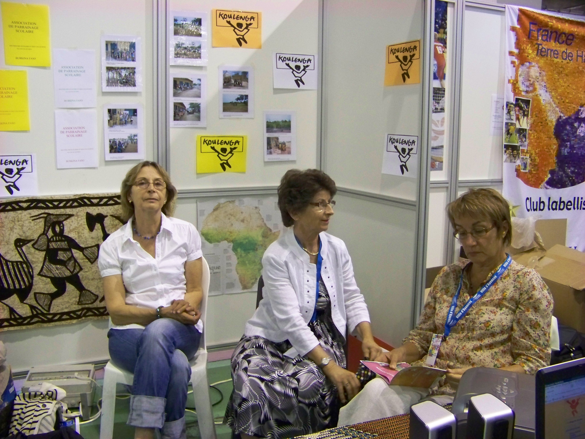
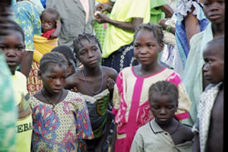
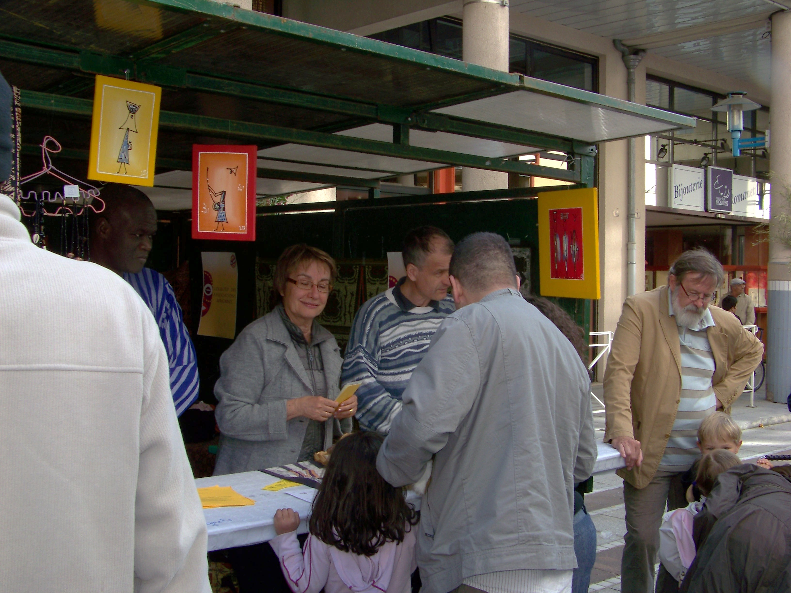

# Koulenga, à Oyonnax, en France

L'association existe depuis fin 2005, elle a connu diverses modifications dans ses statuts pour coller au plus près aux besoins de l'école de Goudrin.

Pour l'instant, l'objectif principal est le suivant:
_"Koulenga a pour objet, tout en développant des valeurs de partage, de solidarité, d’amitié, dans le cadre d’échanges interculturels, de permettre à des enfants scolarisés au Burkina Faso de suivre une scolarité en école primaire et secondaire. Elle décide de subvenir éventuellement à leurs besoins alimentaires, sanitaires et culturels en relation avec les projets proposés par l'Association Burkinabé Teeli Yan."_

Pour cela, il nous faut trouver des fonds, tout en faisant connaître le Burkina, ses habitants et le village de Goudrin.

Nous sommes donc amenés à rencontrer les médias (presse écrite ou radio) et à présenter nos actions dans les établissements scolaires publics ou privés.

Chaque année les élèves de 6ème et de CM2 de l'établissement scolaire Saint Joseph participent au cross _Courir pour Koulenga_.

En ville, nous avons participé :

- à la fête du printemps en collaboration avec trois autres associations intervenant en Afrique (stand à la Grenette).
- à une action menée par le centre social Ouest dans le cadre de la S.S.I (Semaine Solidarité Internationale).
- à la manifestation : _Associations en fête_ 

Nous sommes toujours prêts à répondre positivement aux invitations des écoles, des associations, des groupes qui veulent connaître Koulenga et le Burkina.

## Les adhérents

Nous sommes actuellement une quarantaine d'adhérents à participer au soutien des actions en faveur de l'école de Goudrin. L'argent des cotisations est utilisé pour des actions concrètes comme la cantine ou l'amélioration des structures et l’achat de matériel (cantine, préau, bancs et tables, moustiquaires, etc …).

## Le conseil d'administration

Il est composé de 9 membres : 3 pour le bureau et 6 administrateurs.

- La présidente : Marie-Hélène Sibois
- La trésorière : Colette Ferrandon
- La secrétaire : Geneviève Balland

## Administrateurs

- Marie-Christine Alberto Perroud
- Christian Aymoz
- Brigitte Duraffourg
- Bintou-Corinne Nacoulma
- Marie Odile Pernod
- Gérard Sibois.

## # L'assemblée générale

Statutairement, elle se tient une fois par an, elle réunit l'ensemble des adhérents et amis de l'association qui sont tenus au courant des activités et consultés sur les actions à mettre en place
.[COMPTE RENDU AG 2018.pdf](COMPTE%20RENDU%20AG%202018.pdf)
[COMPTE RENDU AG 2017.pdf](COMPTE%20RENDU%20AG%202017.pdf)

----

