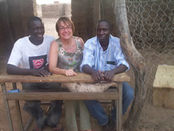
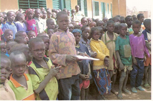

# L'association

## Koulenga, à Oyonnax, en France

L'association existe depuis fin 2005, elle a connu diverses modifications dans ses statuts pour coller au plus près aux besoins de l'école de Goudrin.

Pour l'instant, l'objectif principal est le suivant:

_"Koulenga a pour objet, tout en développant des valeurs de partage, de solidarité, d’amitié, dans le cadre d’échanges interculturels, de permettre à des enfants scolarisés au Burkina Faso de suivre une scolarité en école primaire et secondaire. Elle décide de subvenir éventuellement à leurs besoins alimentaires, sanitaires et culturels en relation avec les projets proposés par l'Association Burkinabé Teeli Yan."_

Pour cela, il nous faut trouver des fonds, tout en faisant connaître le Burkina, ses habitants et le village de Goudrin.

Nous sommes donc amenés à rencontrer les médias (presse écrite ou radio) et à présenter nos actions dans les établissements scolaires publics ou privés.

Chaque année les élèves de 6ème et de CM2 de l'établissement scolaire Saint Joseph participent au cross _Courir pour Koulenga_.

En ville, nous avons participé :
- à la fête du printemps en collaboration avec trois autres associations intervenant en Afrique (stand à la Grenette).
- à une action menée par le centre social Ouest dans le cadre de la S.S.I (Semaine Solidarité Internationale).
- à la manifestation : _Associations en fête_ 

Nous sommes toujours prêts à répondre positivement aux invitations des écoles, des associations, des groupes qui veulent connaître Koulenga et le Burkina.

### Les adhérents

Nous sommes actuellement une quarantaine d'adhérents à participer au soutien des actions en faveur de l'école de Goudrin. L'argent des cotisations est utilisé pour des actions concrètes comme la cantine ou l'amélioration des structures et l’achat de matériel (cantine, préau, bancs et tables, moustiquaires, etc …).

### Le conseil d'administration

Il est composé de 9 membres : 3 pour le bureau et 6 administrateurs.

- La présidente : Marie-Hélène Sibois
- La trésorière : Colette Ferrandon
- La secrétaire : Geneviève Balland

### Administrateurs

- Marie-Christine Alberto Perroud
- Christian Aymoz
- Brigitte Duraffourg
- Bintou-Corinne Nacoulma
- Marie Odile Pernod
- Gérard Sibois.

## Teeli Yan, au Burkina

En novembre 2015, Saabane Ouedraogo (notre référent au Burkina) a mis en place l'Association Teeli Yan (_« soutenir »_ en moré).

Cette association est composée de 4 membres (2 hommes, 2 femmes). Légalement enregistrée elle peut travailler avec différents partenaires, tant au Burkina qu'en France. Elle est notre interlocuteur et travaille en relation avec les parents d'élèves de Goudrin.

Teeli Yan est une association indépendante, c'est à dire qu'elle est libre de tout lien syndical, religieux ou politique. Elle développera 3 objectifs principaux :

- favoriser la scolarisation des enfants du primaire et du secondaire au Burkina Faso
- créer des échanges interculturels
- élaborer et réaliser des projets en amenant les bénéficiaires à s'autogérer. 

### Bureau exécutif de l'association

- Président : Saabane OUEDRAOGO
- Secrétaire générale : Sawadogo Saïdou
- Trésorière : Bikienga Mariam
- Trésorière adjointe : Ouedraogo Saabane
- Responsable à l'information : Yiougo Salam
 

Exemples concrets pour ces différents points :

- Soutien des enfants en difficulté pendant les vacances.
- Création de champs cultivés en commun pour alimenter une cantine endogène. Pour info, l'État vient de créer un service pour alimenter les cantines pour les 2 700 000 élèves. Cette somme assure 3 mois de nourriture.
- Dans le domaine santé et hygiène: soutien par l'apport de matériel et de médicaments génériques.
- Création d'échanges entre les différents partenaires à distance.
- Travailler à l'émergence des femmes en tant qu'actrice du développement

## Adhésions et dons

**Les adhésions** concernent les personnes qui s'engagent pour une année (renouvelable) à cotiser pour 100€ à Koulenga. Sur ces 100€ :
- 20€ restent pour le fonctionnement de l'Association (téléphone, timbres, papeterie, assurance …)
- 80€ sont consacrées aux actions au Burkina.

**Les dons** concernent toutes les personnes qui veulent ponctuellement nous aider. Les sommes ainsi recueillies sont entièrement consacrées aux actions au Burkina.

[Bulletin_Adhesion.pdf](Bulletin_Adhesion.pdf)

## Les statuts de Koulenga

[Télécharger les statuts au format PDF](Statuts.pdf)

---
 
