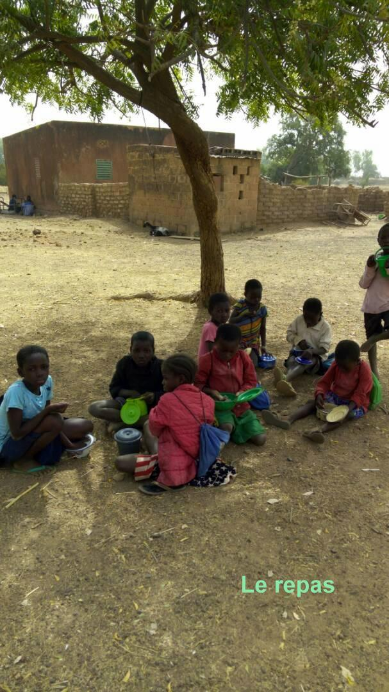
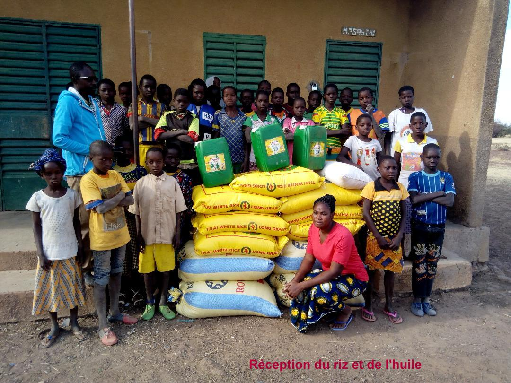
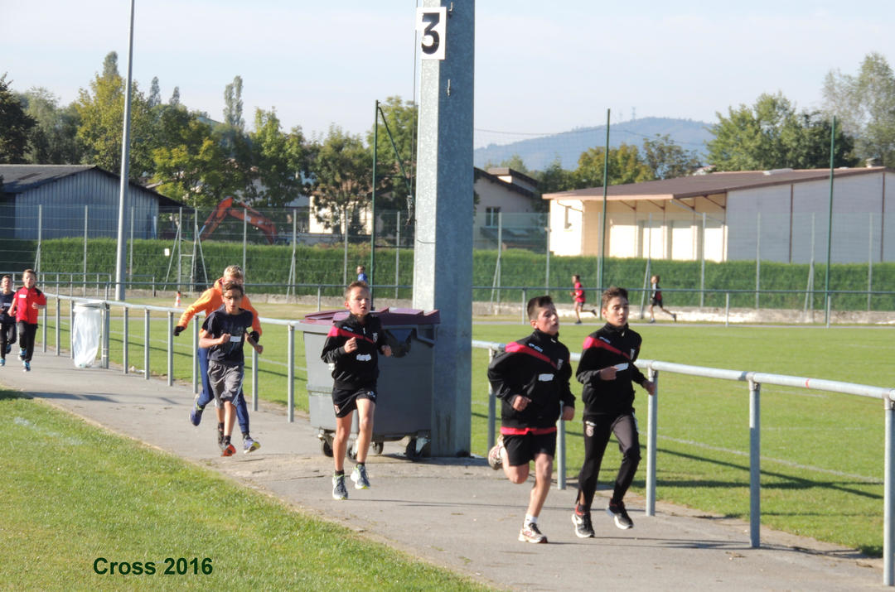

# Les actions à venir

Pour l'année 2022 nous prévoyons :

- d'intensifier notre participation à la cantine pour répondre à la situation climatique et à l'augmentation du coût de la vie qui risque de priver les élèves d'un repas régulier.
- renouveler les opérations avec les établissements scolaires: cross "courir pour Koulenga" 
- de renouveler l'opération "P'tit Dèj"
- étudier les possibilités pour répondre aux suggestions de Teeli Yan si la situation au Burkina s'améliore.

