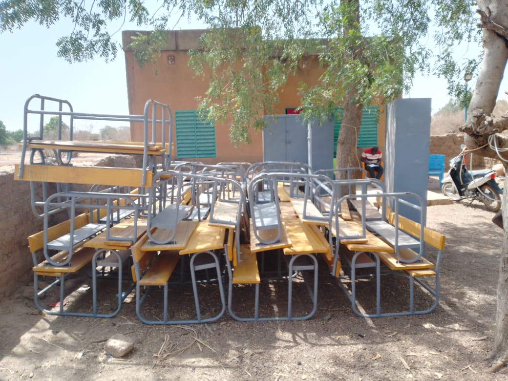
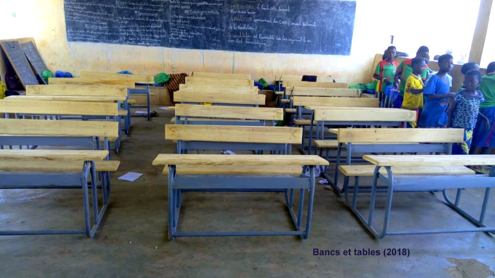
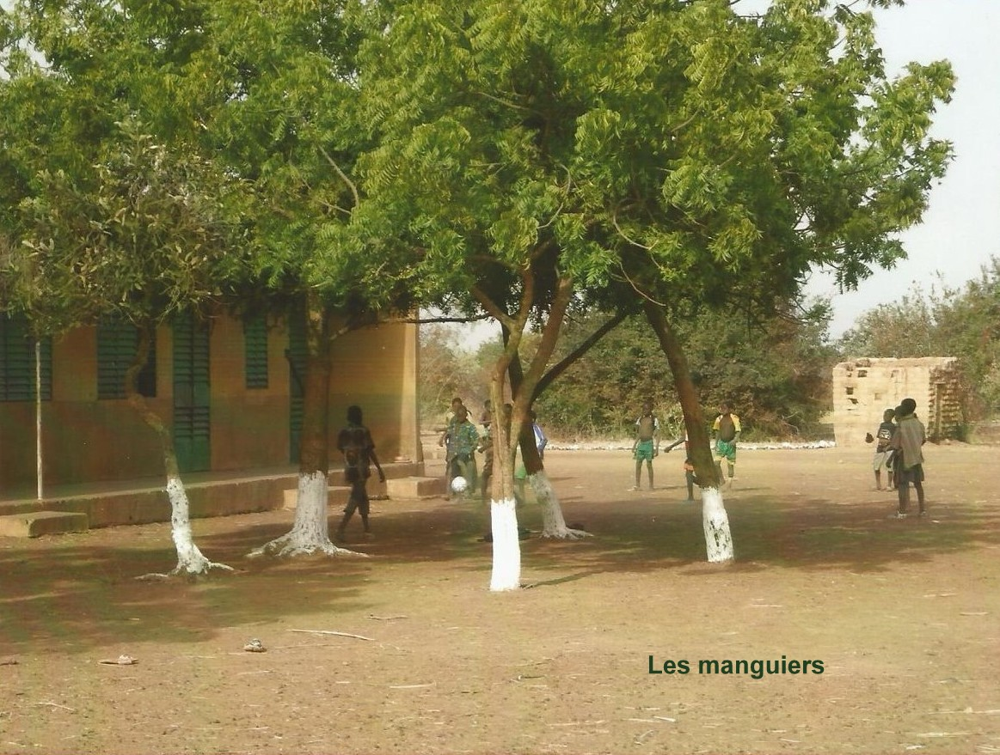
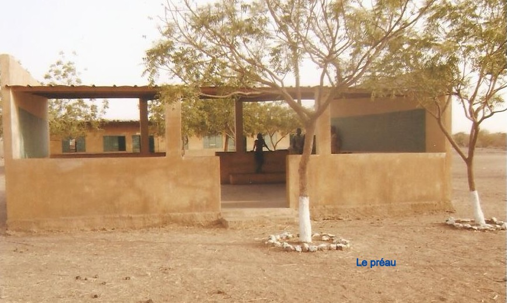
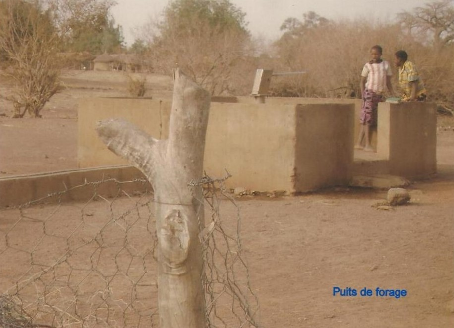
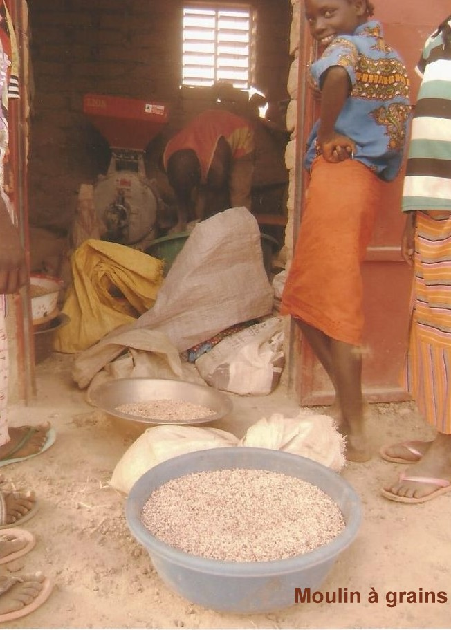
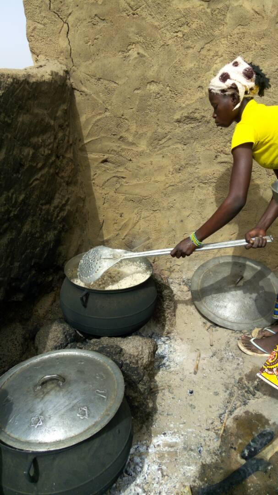

# Les réalisations

Les projets sont définis par les villageois (Associations des pères et mères d'élèves) et l'Association TEELI YAN qui nous fait des propositions et gère les réalisations sur place. Le conseil d'administration de Koulenga décide en fonction des possibilités de  de les soutenir ou pas.

**Juillet 2025**
Les tables demandées pour continuer l'équipement des salles de classe, on été livrées et sont en attente d'installation.

**Novembre 2024**
Dernièrement la demande du village a été le financement de l'installation de lampadaires dans la cour de l'école pour permettre aux élèves de faire leurs devoirs dans la cour le soir.
Voilà qui est fait!

**Projets réalisés entre 2005 et 2015 :**

- Distribution d'une **moustiquaire** à chaque élève à la rentrée 2006 et en 2010.
- Distribution d'un **tee-shirt** à chaque écolier
- Cantine: aménagement du local, construction d'un poulailler, aménagement d'un jardin scolaire
- Plantation de **manguiers** devant l’école, la première récolte a eu lieu en 2011.
- Différents travaux d'entretien: réparation du puits de l'école, réfection des logements des instituteurs et des latrines
- Construction d’un **préau** pour l’école pendant la période scolaire et salle de réunion pour le village, les parents participent aux travaux et financent à hauteur de 10%. 
- Achat de 14 **tables-bancs** pour le préau, les parents financent à hauteur d’environ 15%.
- Accueil des élèves d'une autre école ou déplacement dans une autre école
- Aménagement d'un terrain de football et hand-ball (participation des parents aux travaux)
- Achat d'un **moulin à grains** et aménagement du local : les parents financent à hauteur de 4% environ et participent aux travaux. Ce sont les mères qui sont responsables de la gestion de moulin ; la participation des utilisateurs alimente directement  la caisse de cantine.
- Achat d'une armoire métallique et de deux chaises pour l'administratif.
- Construction d'un local pour la fabrication de savons (projet soutenu par l'association des mères d'élèves : A.M.E.)
- Aménagement d'un terrain pour la plantation d'un verger (grillage, piquets).
- Achat de **bancs et tables** pour répondre à l'augmentation du nombre d'élèves.

**Depuis 2015**:

- Aide ponctuelle pour les collégiens
- Participation au transport et montage de tentes-classes.
- Achat de  l'équipement complet pour les trois  salles de classe du nouveau bâtiment (tables-bancs,bureau pour l'instituteur, tableau, armoire et 2 chaises)
- Achat de matériel pédagogique: 
    - 14 dictionnaires
	- 6 règles plates
	- 6 compas
	- 2 globes terrestres 
	- 3 cartes murales 
- Construction de 2 logements pour les instituteurs
- Kit éclairage pour le Centre de Soins et de Promotion Sociale.
Les photos du matériel scolaire et de l'éclairage du Centre de Soins et de Promotion Sociale sont visibles dans l'onglet "Diaporama"

De manière récurrente chaque année nous participons à **la cantine** par des achats de riz et d'huile - une fois à l'automne - Une fois  au printemps. Cette aide permet d'assurer un repas par jour au élèves en complément de l'aide de l'état (qui couvre 3 mois) et de l'apport des parents selon les récoltes: par enfant, une platée de sorgho pour les mères, une platée de haricots pour les pères.

  

