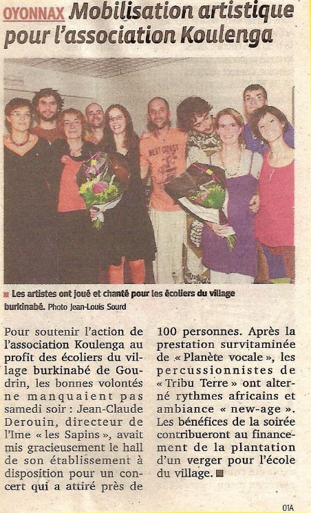

# Avec la presse

## Le Progrès

* Octobre 2012

* Novembre 2012 : _Les collégiens de Saint Joseph ont Couru pour Koulenga_

* Avril 2011

* Mai 2011 : Assemblée générale de koulenga

* Novembre 2011 : Courir pour Koulenga

## La voix de l'Ain
*  2011

*  2012

*  2019

*   2020

