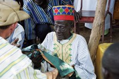
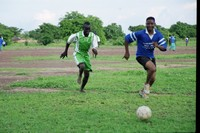
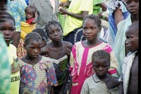
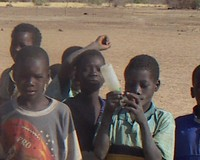

 

----

# Le parrainage

Enseignants et parents de Goudrin ont réalisé en novembre 2004 un projet de parrainage.

initiative qui permettra au plus grand nombre d'enfants d'accéder à l'éducation.

Ce parrainage soutiendra un élève dans sa scolarité et établira une correspondance entre cet élève
et son parrain.

Le parrain recevra une photo de son filleul ainsi qu'un suivi annuel de son travail scolaire.

 

----
 

----
Pour nous soutenir, envoyez le [formulaire de parrainage (à imprimer)](soutien.pdf) accompagné de votre participation de 70€
